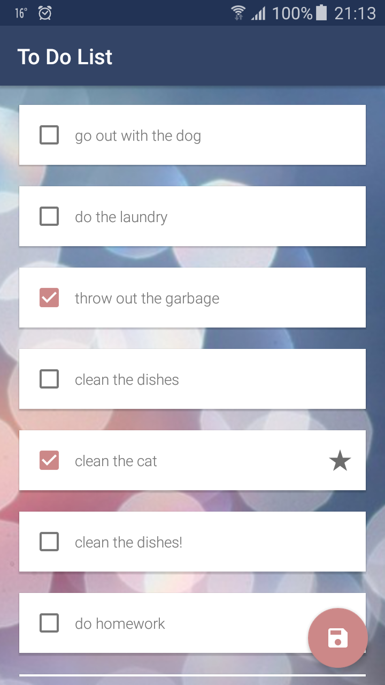

# To Do List (MVVM)

Simple to do list app. 

My goal was to create the app with similar functionality like in [this project] (https://github.com/PaulinaSadowska/ToDoList) but using MVVM(C) pattern, Dependency Injection, Reactive Programming, Realm, Unit Tests and UI tests with Espresso.

    

